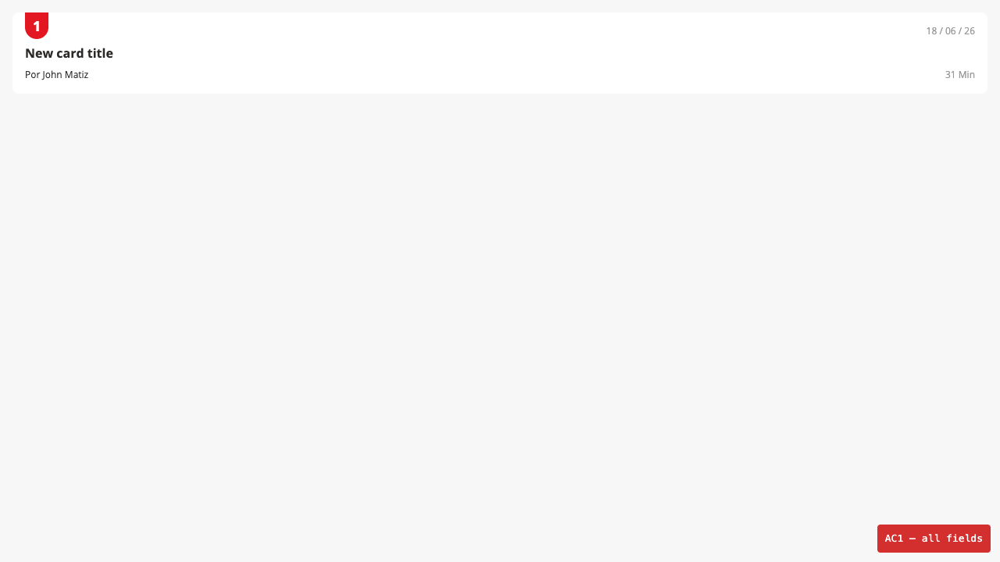
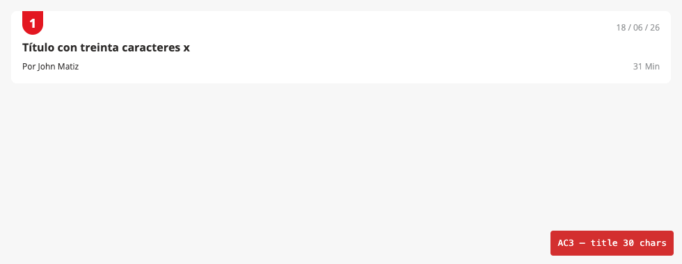
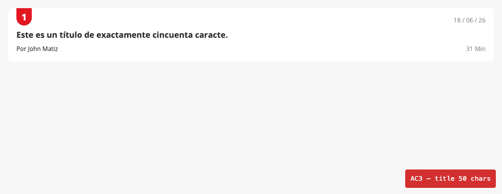
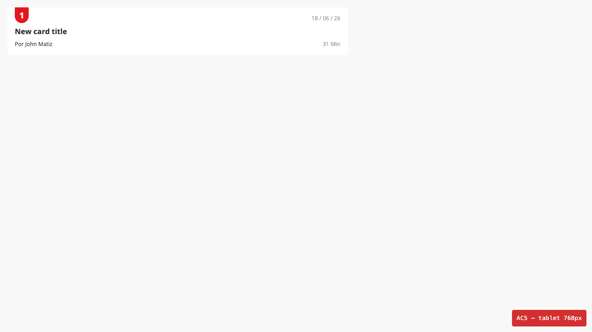

# SUFI-110 — Smoke: Manual + Playwright (run log)

**Fecha:** 2026-06-18 · **Tester:** JCCoello (juancarlos.coello@applydigital.com)

**Entorno:**
- Storybook: https://sufi-acl.vercel.app/?path=/story/molecules-news-card--default

**Resultado global:** ✅ 5/5 Pass — sin defectos encontrados.

---

**1. [SUFI-110] [AC1] - El componente News Card renderiza en Storybook con todos sus campos visibles**
**Prioridad:** High · **Resultado:** ✅ Pass
- **GIVEN** la historia default del componente News Card en Storybook con el Canvas completamente cargado; DevTools abierto en la pestaña Console
- **WHEN** observar visualmente el componente en el canvas verificando la presencia de todos los campos; revisar la consola en busca de errores o advertencias
- **THEN** el componente News Card muestra todos sus campos correctamente
- **Esperado:** Badge numérico visible con fondo rojo, fecha renderizada, título legible, autor con prefijo «Por» y tiempo de lectura con sufijo «Min»; sin errores en consola
- **Observado:** Todos los campos presentes y visibles — badge: "1" (.ml-news-card__position), fecha: "18 / 06 / 26", título: "New card title", autor: "Por John Matiz", tiempo: "31 Min". Sin errores de componente en consola (1 error de redirect Vercel JWT en PROD — no relacionado).

---

**2. [SUFI-110] [AC2] - El badge numérico del News Card muestra el valor correcto con el estilo del design system SUFI**
**Prioridad:** High · **Resultado:** ✅ Pass
- **GIVEN** la historia default del componente News Card en Storybook con el Canvas completamente cargado
- **WHEN** observar el badge numérico verificando color, tamaño y posición; inspeccionar con DevTools si es necesario para confirmar clases CSS de color aplicadas
- **THEN** el badge muestra el número con fondo rojo/primario coincidente con el design system SUFI
- **Esperado:** Badge con fondo rojo/primario, texto blanco, valor numérico correcto
- **Observado:** Background computado `rgb(227, 23, 33)` — rojo de marca confirmado. Texto color `rgb(255, 255, 255)`. Clase: `ml-news-card__position bc-border-radius-5-bottom`.

---

**3. [SUFI-110] [AC3] - El título del News Card acepta entre 30 y 50 caracteres y se muestra sin truncamiento ni desbordamiento**
**Prioridad:** High · **Resultado:** ✅ Pass
- **GIVEN** la historia default del componente News Card en Storybook con el panel de Controls visible
- **WHEN** reemplazar el título con texto de 30 caracteres y luego con 50 caracteres; verificar en cada caso que el componente renderiza sin truncamiento ni overflow
- **THEN** el componente muestra ambos títulos sin truncamiento, sin desbordamiento del contenedor y sin errores visuales
- **Esperado:** Títulos de 30 y 50 caracteres visibles completos, sin text-overflow:ellipsis
- **Observado:** 30 chars (`Título con treinta caracteres x`): textOverflow=clip, isTruncated=false. 50 chars (`Este es un título de exactamente cincuenta caracte.`): textOverflow=clip, scrollWidth===clientWidth (916px), isTruncated=false.

---

**4. [SUFI-110] [AC4] - La fecha del News Card se renderiza en formato DD/MM/AA**
**Prioridad:** High · **Resultado:** ✅ Pass
- **GIVEN** la historia default del componente News Card en Storybook con el Canvas completamente cargado
- **WHEN** observar el campo de fecha verificando que se presenta en formato DD/MM/AA
- **THEN** el campo de fecha muestra la fecha en formato DD/MM/AA consistente con la referencia de Figma
- **Esperado:** Fecha en formato DD/MM/AA (dos dígitos separados por «/»)
- **Observado:** Fecha "18 / 06 / 26" → normalizada "18/06/26" — coincide con patrón `/^\d{2}\/\d{2}\/\d{2}$/`.

---

**5. [SUFI-110] [AC5] - El componente News Card es responsivo en viewports de tablet (768px) y móvil (375px)**
**Prioridad:** High · **Resultado:** ✅ Pass
- **GIVEN** la historia default del componente News Card en Storybook con el Canvas completamente cargado; control de viewport disponible
- **WHEN** seleccionar viewport tablet (768px) y verificar que el componente se muestra sin desbordamiento horizontal; repetir en viewport móvil (375px)
- **THEN** en ambos breakpoints el componente se adapta al ancho disponible sin overflow y con todos los campos visibles
- **Esperado:** Sin desbordamiento horizontal, todos los campos visibles en 768px y 375px
- **Observado:** Tablet 768px: cardWidth=736px, noOverflow=true, overflowingChildren=0, allFields=true. Móvil 375px: cardWidth=343px, noOverflow=true, overflowingChildren=0, allFields=true. El componente usa flex-direction:column sin breakpoints — adaptación fluida.

---

## Notas

- Sin defectos encontrados durante esta sesión.
- Verificación automatizada ejecutada con Playwright (`tests/sufi-110-news-card-smoke.spec.ts`). 1 test · 1 passed · 12.7s.

### Tabla de verificación automatizada

| AC | Verificación | Resultado |
|----|-------------|-----------|
| AC1 | Todos los campos presentes en DOM (badge, fecha, título, autor, tiempo) | ✅ Pass |
| AC1 | Sin errores de componente en consola | ✅ Pass |
| AC2 | Background computado del badge es rojo/primario (`rgb(227, 23, 33)`) | ✅ Pass |
| AC3 | Título 30 chars: textOverflow≠ellipsis, isTruncated=false | ✅ Pass |
| AC3 | Título 50 chars: textOverflow≠ellipsis, isTruncated=false | ✅ Pass |
| AC4 | Fecha normalizada coincide con `/^\d{2}\/\d{2}\/\d{2}$/` | ✅ Pass |
| AC5 | Tablet 768px: noOverflow=true, allFields=true | ✅ Pass |
| AC5 | Móvil 375px: noOverflow=true, allFields=true | ✅ Pass |

### Evidencia (screenshots)

| Archivo | AC | Imagen |
|---------|-----|--------|
| sufi110-AC1-all-fields.png | AC1 |  |
| sufi110-AC2-badge-style.png | AC2 |  |
| sufi110-AC3-title-30chars.png | AC3 |  |
| sufi110-AC3-title-50chars.png | AC3 |  |
| sufi110-AC4-date-format.png | AC4 |  |
| sufi110-AC5-tablet-768px.png | AC5 |  |
| sufi110-AC5-mobile-375px.png | AC5 |  |
