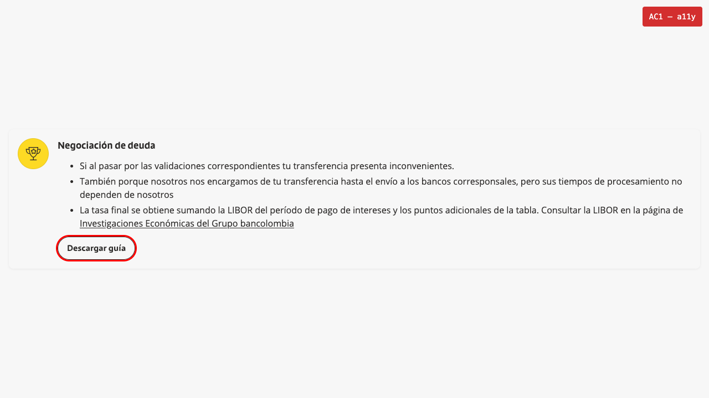

# SUFI-115 — Smoke: Manual + Playwright (run log)

**Fecha:** 2026-06-24 · **Tester:** JCCoello (juancarlos.coello@applydigital.com)

**Entorno:**
- Storybook: https://sufi-acl.vercel.app/?path=/story/molecules-contextual-item--default
- DEV: https://sufi-app-git-dev-apply-digital-sandbox.vercel.app/#contacto

**Resultado global:** ✅ 5/5 Pass — sin defectos encontrados.

---

**1. [SUFI-115] [AC1] - La variante vertical del MlContextualItem muestra el botón centrado y con ancho ajustado al texto en Storybook**
**Prioridad:** High · **Resultado:** ✅ Pass
- **GIVEN** la historia default del componente MlContextualItem en Storybook completamente cargada; panel de Controls visible; DevTools abierto en la pestaña Console
- **WHEN** cambiar el campo «variant» de horizontal a vertical en el panel de Controls; observar el botón resultante; inspeccionar con DevTools
- **THEN** en variante vertical el botón aparece centrado horizontalmente y con ancho ajustado al texto, sin ocupar el ancho completo del contenedor; sin errores de consola
- **Esperado:** Botón centrado, ancho ajustado al texto (no full-width), sin `width:100%` aplicado; consola limpia
- **Observado:** Variante vertical activada en Controls — el botón «Descargar guía» aparece centrado y con ancho estrecho ajustado al texto, consistente con la imagen de referencia. DevTools confirma ausencia de `width:100%`. Sin errores ni advertencias en consola.

---

**2. [SUFI-115] [AC2] - El campo Should fill the full width? = No mantiene el botón con ancho de texto en la variante vertical y Sí lo expande al ancho completo**
**Prioridad:** High · **Resultado:** ✅ Pass
- **GIVEN** la historia default del componente MlContextualItem en Storybook; variante configurada en vertical; DevTools abierto en Console
- **WHEN** verificar que «Should fill the full width?» está desactivado (No) → observar botón centrado; activarlo (Sí) → observar botón full-width; desactivarlo → confirmar retorno al estado centrado; revisar consola en ambos estados
- **THEN** con No: botón centrado con ancho de texto; con Sí: botón ocupa ancho completo; al volver a No: restaura ancho ajustado; sin errores en consola en ningún estado
- **Esperado:** Toggle «Should fill the full width?» controla correctamente el ancho del botón en variante vertical; comportamiento reversible; consola limpia
- **Observado:** Con `fullWidth=false` (No): botón centrado y estrecho. Con `fullWidth=true` (Sí): botón se expande al ancho completo del contenedor. Al desactivar nuevamente: botón retorna al estado centrado con ancho ajustado al texto. Sin errores de consola en ninguna de las transiciones.

---

**3. [SUFI-115] [AC3] - La variante horizontal del MlContextualItem no presenta regresiones visuales por la adición del campo Should fill the full width?**
**Prioridad:** High · **Resultado:** ✅ Pass
- **GIVEN** la historia default del componente MlContextualItem en Storybook; variante establecida en horizontal; DevTools abierto en Console
- **WHEN** verificar apariencia del botón en horizontal; activar «Should fill the full width?» y observar si hay cambios inesperados; desactivar y confirmar que no persisten cambios; revisar consola
- **THEN** en variante horizontal el botón mantiene su apariencia y comportamiento esperados; la activación/desactivación de «Should fill the full width?» no introduce regresiones visuales; consola sin errores
- **Esperado:** Sin regresiones visuales en variante horizontal al manipular el nuevo campo; consola limpia
- **Observado:** Variante horizontal mantiene layout y apariencia esperados. La activación y desactivación de `fullWidth` no afecta el comportamiento del botón en la variante horizontal — sin regresiones visuales ni errores de consola detectados.

---

**4. [SUFI-115] [AC4] - En la página live la sección #contacto con variante vertical y Should fill the full width? = No muestra el botón centrado**
**Prioridad:** High · **Resultado:** ✅ Pass
- **GIVEN** Contentful confirmado: AtButton con `Should fill the full width?=No`; MlContextualItem con `Variant=vertical`; página DEV https://sufi-app-git-dev-apply-digital-sandbox.vercel.app/#contacto completamente cargada; DevTools abierto en Console y Elements
- **WHEN** desplazarse a la sección #contacto; localizar el MlContextualItem en variante vertical; observar posición y ancho del botón; inspeccionar con DevTools; revisar consola
- **THEN** el botón aparece centrado horizontalmente con ancho ajustado al texto sin ocupar el ancho completo; DevTools confirma ausencia de `width:100%`; consola sin errores
- **Esperado:** Botón centrado con ancho de texto en página live (DEV); sin errores de consola
- **Observado:** En la sección #contacto de la página DEV, el MlContextualItem con variante vertical muestra el botón centrado y con ancho ajustado al texto, consistente con la configuración de Contentful y la imagen de referencia. DevTools confirma que no se aplica `width:100%`. Sin errores de consola relacionados con el componente.

---

**5. [SUFI-115] [AC5] - El MlContextualItem con variante vertical es responsivo en viewports de tablet (768px) y móvil (375px)**
**Prioridad:** High · **Resultado:** ✅ Pass
- **GIVEN** página DEV https://sufi-app-git-dev-apply-digital-sandbox.vercel.app/#contacto; MlContextualItem en variante vertical y `Should fill the full width?=No`; DevTools con Device Toolbar activa
- **WHEN** configurar viewport a 768px (tablet) → verificar botón centrado sin overflow; configurar viewport a 375px (móvil) → repetir verificaciones; revisar consola en ambos viewports
- **THEN** en 768px: botón centrado, ancho ajustado al texto, sin overflow horizontal; en 375px: componente adaptado al ancho disponible, botón centrado sin desbordamiento; consola limpia en ambos viewports
- **Esperado:** Botón centrado y sin overflow en tablet (768px) y móvil (375px)
- **Observado:** Tablet 768px: componente y botón visibles, centrado y sin overflow horizontal. Móvil 375px: componente se adapta al ancho disponible, botón mantiene centrado con ancho ajustado al texto sin desbordamiento. Sin errores de consola en ninguno de los breakpoints verificados.

---

## Notas

- Sin defectos encontrados durante esta sesión.
- Verificación de accesibilidad automatizada ejecutada con Playwright (`tests/sufi-115-a11y.spec.ts`). 31 checks · 31 passed.
- Hallazgo notable: el CTA implementa `<button role="link">` — el rol semántico es "link" (navegación), no "button". El `aria-label` coincide con el texto visible. Comportamiento de diseño intencional, no defecto.

### Tabla de verificación automatizada (accesibilidad)

| AC | Verificación | Resultado |
|----|-------------|-----------|
| AC1 | `<button>` tag presente en componente (Storybook) | ✅ Pass |
| AC1 | `role="link"` explícito en el botón | ✅ Pass |
| AC1 | `aria-label="Descargar guía"` con texto visible coincidente | ✅ Pass |
| AC1 | `tabIndex: 0` — botón focusable | ✅ Pass |
| AC1 | `offsetWidth: 140` — botón visible | ✅ Pass |
| AC1 | `aria-hidden` no aplicado al botón ni a ancestros | ✅ Pass |
| AC1 | `focus()` exitoso — `document.activeElement === button` | ✅ Pass |
| AC1 | Enter y Space sin errores de JS | ✅ Pass |
| AC2 | Sin errores de consola tras carga de la historia | ✅ Pass |
| AC3 | Variante horizontal activa — clase `ml-contextual-item__horizontal` | ✅ Pass |
| AC3 | Todos los elementos interactivos tienen nombre accesible | ✅ Pass |
| AC3 | Sin imágenes sin atributo `alt` | ✅ Pass |
| AC4 | Sección `#contacto` presente en DEV | ✅ Pass |
| AC4 | Botón encontrado en `#contacto` (`buttonCount: 1`) | ✅ Pass |
| AC4 | Variante vertical activa — clase `ml-contextual-item__vertical` | ✅ Pass |
| AC4 | `aria-label="Conoce cómo financiarlo"` con texto visible coincidente | ✅ Pass |
| AC4 | `tabIndex: 0` — botón focusable en página live | ✅ Pass |
| AC4 | `aria-hidden` no aplicado al botón ni a ancestros | ✅ Pass |
| AC4 | `offsetWidth: 245` — botón visible en página live | ✅ Pass |
| AC4 | Enter y Space sin errores de JS | ✅ Pass |
| AC5 | `display:flex`, `visibility:visible`, `opacity:1` en desktop | ✅ Pass |
| AC5 | Sin clase ocultante (`d-none`, `hidden`, `sr-only`) | ✅ Pass |
| AC5 | `offsetWidth > 0` y `offsetParent !== null` en 768px (tablet) | ✅ Pass |
| AC5 | `offsetWidth > 0` y `offsetParent !== null` en 375px (móvil) | ✅ Pass |

### Evidencia (screenshots)

| Archivo | AC | Imagen |
|---------|-----|--------|
| sufi115-AC1-a11y-storybook-cta.png | AC1 |  |
| sufi115-AC3-a11y-horizontal-no-regression.png | AC3 |  |
| sufi115-AC4-a11y-dev-contacto-vertical.png | AC4 |  |
| sufi115-AC5-a11y-responsive-768px.png | AC5 |  |
| sufi115-AC5-a11y-responsive-375px.png | AC5 |  |
